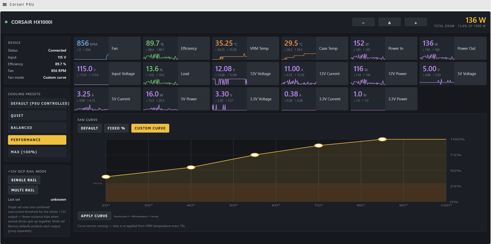

# Corsair PSU Center

An iCUE-style dashboard for Corsair **HXi / RMi** digital power supplies, running as a
native Unraid plugin.

Corsair's own iCUE software is Windows-only, so a Corsair digital PSU in an Unraid
server normally means no monitoring and no fan control at all. This plugin adds both,
in its own tab.



> **Status:** working and in daily use on an ASUS X299 / Unraid 7.2.7 box with an
> HX1000i. Only that model has been tested on real hardware — the other eleven are
> supported by the same detection path but are, honestly, untested. Reports welcome.

---

## Features

**Live monitoring** — read from the kernel's `corsair-psu` hwmon driver, so polling
costs no USB traffic and cannot collide with anything else talking to the PSU:

- Per-rail voltage, current and power for +12V, +5V and +3.3V
- Total power out, estimated power in, efficiency, load %
- VRM and case temperatures, fan RPM
- Every tile carries a running min/max and a live sparkline

**Fan control**

- **Default** — hand the fan back to the PSU's own firmware (zero-RPM idle)
- **Fixed %** — hold a constant duty, 30–100%
- **Custom curve** — drag-and-drop curve editor mapping VRM temperature to fan duty
- Presets: Quiet, Balanced, Performance, Max

**+12V OCP rail mode** — toggle between single-rail and multi-rail overcurrent
protection. Single rail uses one combined threshold for the whole +12V output, which
means fewer nuisance trips when several drives spin up at once.

**Adjustable text size** — the whole UI scales from one control, remembered per browser.

---

## Supported hardware

Any PSU handled by the kernel `corsair-psu` driver. The model is detected at runtime
from its USB HID product id — nothing is hardcoded.

| | |
|---|---|
| HX series | HX750i, HX850i, HX1000i, HX1000i (2022), HX1200i, HX1200i ATX 3.1, HX1500i |
| RM series | RM650i, RM750i, RM850i, RM1000i |

An unrecognised Corsair PSU still works for everything the kernel exposes (rails,
power, temperatures, fan, and fan control). Only efficiency, input power and load %
are hidden, because those need model-specific coefficients — the plugin will show
`n/a` rather than invent a number.

**Requires Unraid 6.12.0 or newer.**

---

## Install

Unraid → **Plugins** → **Install Plugin**, paste the URL of `corsairpsucenter.plg`,
and click Install. Then open the **CorsairPSUCenter** tab in the top menu.

The package is self-contained: it bundles every Python module it needs. No `pip`, no
internet access at install or boot, and nothing to configure by hand. Unraid re-runs
the `.plg` on each boot, so it survives reboots on its own.

To remove it, use the Plugins page. Uninstall stops the fan service, hands the fan
back to the PSU firmware, and removes everything it installed.

---

## How it works

Two deliberately separate paths:

- **Telemetry → sysfs.** The kernel `corsair-psu` hwmon driver publishes all sensors
  under `/sys/class/hwmon/hwmonN/`. Reading them is instant, involves no USB traffic,
  and cannot conflict with other software.
- **Control → USB HID via `liquidctl`.** Required, because the kernel driver exposes
  `pwm1` and `pwm1_enable` **read-only** — there is no write path through sysfs. Only
  the two write operations (fan duty, OCP mode) go over USB, targeted by vendor and
  product id.

**Efficiency and input power are estimates.** The PSU does not report input power, so
it is derived from a per-model quadratic fit of output power, interpolated for mains
voltage. The coefficients come from
[liquidctl](https://github.com/liquidctl/liquidctl)'s `corsair_hid_psu` driver.

### Why a background service for the fan curve

These PSUs **cannot store a fan curve in firmware** — `set_speed_profile` is
`NotSupportedByDevice` for this family; the hardware only accepts a single fixed duty.
iCUE on Windows works around this by polling temperature and rewriting the duty, and
this plugin does the same: a small daemon reads VRM temperature every 10 seconds and
re-applies the appropriate duty, writing only when the value actually changes.

Consequences worth knowing:

- **Minimum duty is 30%.** `liquidctl` clamps below that.
- **Curve mode depends on the service running.** The UI tells you if it isn't.
- Choosing **Default** stops the service and returns control to the PSU.

---

## Support

**[Unraid forum support thread](https://forums.unraid.net/topic/200056-plugin-corsair-psu-center-icue-style-dashboard-and-fan-control-for-corsair-hxirmi-psus/)** —
best place for questions, problems, or to report how it behaves on your hardware.
GitHub issues work too if you'd rather report there.

Reports from **other PSU models are especially welcome.** Only the HX1000i has been
tested on real hardware; the other eleven share the same detection path but nobody has
confirmed them yet. If you run one, it's useful to know whether the model name, wattage
and efficiency read correctly.

---

## Layout

```
corsairpsucenter.plg     the installer
archive/                 the .txz package + its md5
src/                     readable sources (also inside the package)
  api.php                telemetry + control endpoint
  fand.sh                fan curve daemon
  CorsairPSUCenter.page  the UI
ca_profile.xml           Community Applications repository profile
plugins/                 Community Applications plugin template
```

---

## Credits

Device protocol, model table and efficiency coefficients come from
[liquidctl](https://github.com/liquidctl/liquidctl), which does the hard part of
talking to these PSUs. The `corsair-psu` hwmon driver is part of the Linux kernel.

## License

GPL-2.0, matching liquidctl and the Unraid plugin ecosystem.
